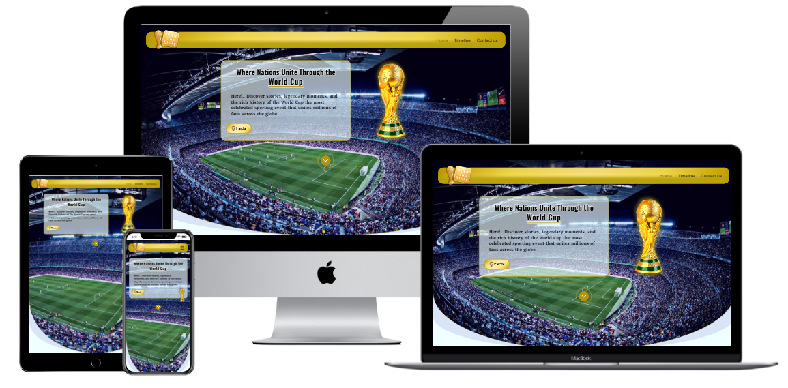

# World-Cup-Story
A simple static website built with HTML &amp; CSS that tells the story of the FIFA Men’s World Cup. It highlights tournaments, winners, and historic moments in football history.

## 📖 Project Overview

This website provides an interactive timeline of the World Cup, starting from the first tournament in 1930 up to the latest editions. It includes information about host countries, champions, and key moments that shaped the tournament’s history.

## 🖥️📱 Responsive Design
It has a responsive design that works with most devices.

## 🧱 Script languages Used

* HTML
* CSS3
  
