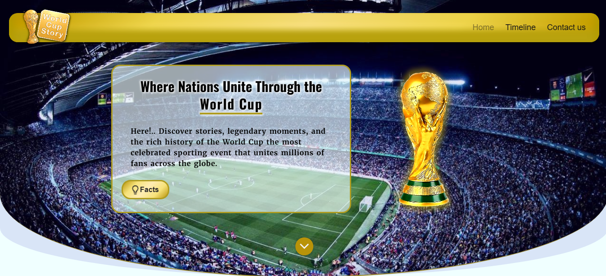
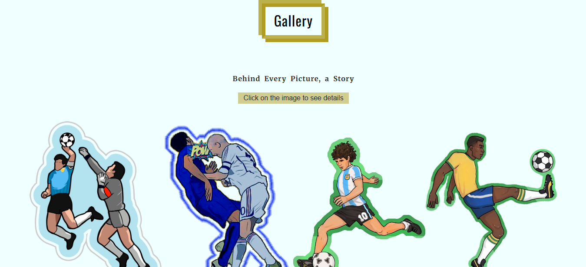
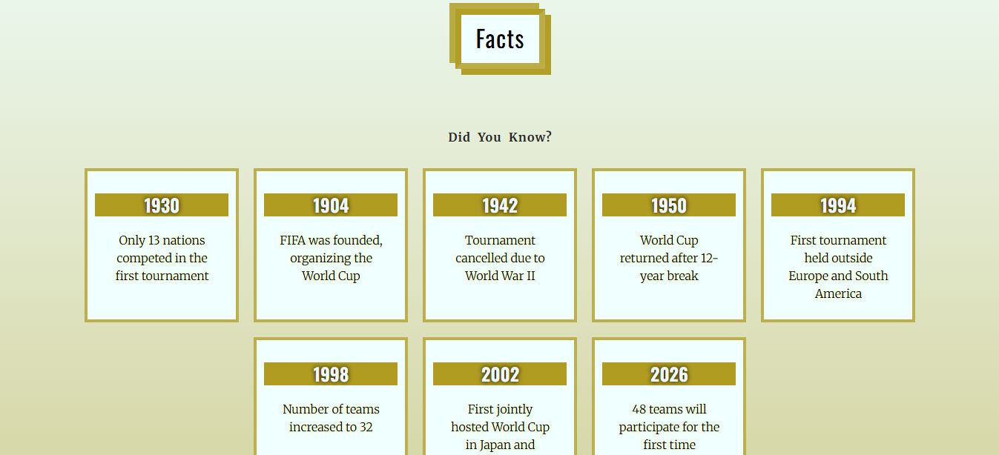
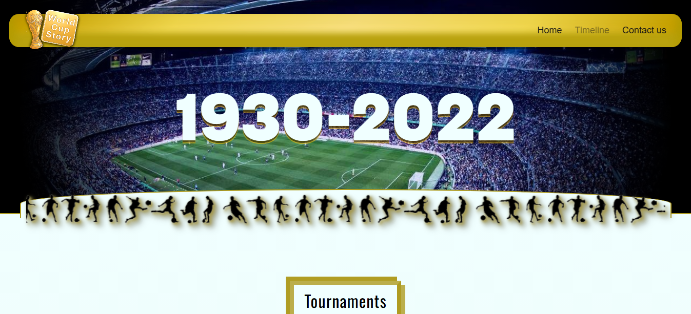
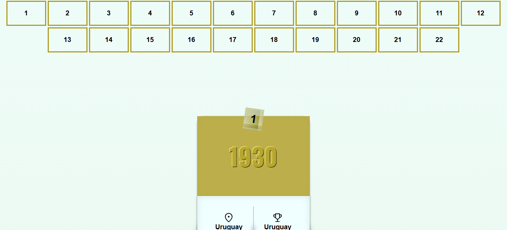
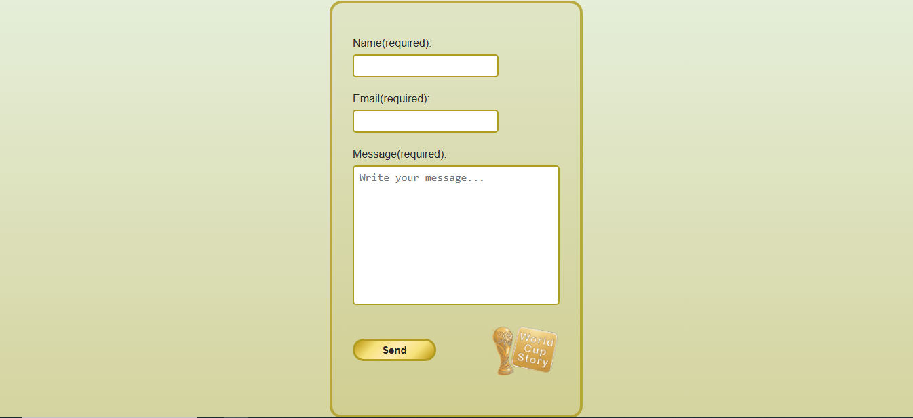

# World-Cup-Story
A simple static website built with HTML &amp; CSS that tells the story of the FIFA Men’s World Cup. It highlights tournaments, winners, and historic moments in football history.

## 📖 Project Overview

This website provides an interactive timeline of the World Cup, starting from the first tournament in 1930 up to the latest editions. It includes information about host countries, champions, and key moments that shaped the tournament’s history.

## 🖥️📱 Responsive Design
*  It has a responsive design that works with most devices.

## 🧱 Script languages Used

* HTML
* CSS

## 🧱 Technologies Used

*  Adobe Photoshop (Edit raster images).
*  Adobe Illustrator (Design a logo as a vector Image).
*  Formsubmit.co (Connect my form to this form endpoint service).
*  Chatgpt (to support and answer on my questions).
*  Git & Github (save my project files and deploy my project on GitHub Pages).

## 📚 Sources of images and information

*  Images from Adobe Stock.
*  Information from Chatgpt.

## 📄 Website contents

*  Three pages:
  -  Home Page (Hero Section, Gallery, Facts):
     
  
  
  
  -  Timeline (Hero Section, Tournaments):
    
  
  
  -  Contact Us (Hero Section, Form):
    
  
  
  
