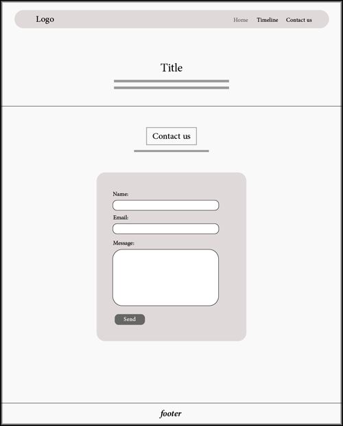

# World-Cup-Story
A simple static website built with HTML &amp; CSS that tells the story of the FIFA Men’s World Cup. It highlights tournaments, winners, and historic moments in football history.

## Project Overview

This website provides an interactive timeline of the World Cup, starting from the first tournament in 1930 up to the latest editions. It includes information about host countries, champions, and key moments that shaped the tournament’s history.

## Responsive Design
*  It has a responsive design that works with most devices.

## Script Languages Used

* 
* 

## Technologies Used

*   (Edit raster images).
*   (Design a logo as a vector Image).
*  Formsubmit.co (Connect my form to this form endpoint service).
*  Chatgpt (to support and answer on my questions).
*  
*  

## Sources of images, fonts and information

*  Images from Adobe Stock.
*  Fonts and icons from Google Fonts.
*  Information from Chatgpt.

## Screenshots

*       World Cup Story Website has Three Pages.
1.  _Home Page (Hero Section, Gallery, Facts)_:
 
       
       
       
      

2. *Timeline (Hero Section, Tournaments)*:
 
    
    
 
  
3.  *Contact Us (Hero Section, Form)*:
 
    
    
 
  
## Design(Wireframes)
*   **<u>Desktop Design:</u>**
1.  _Home Page_:
 
        
 
2.  _Timeline Page_:
 
        
 
3.  _Contact Page_:
 
        
 

*   **<u>Mobile Design:</u>**
1.  _Home Page_:
 
        
 
2.  _Timeline Page_:
 
        
 
3.  _Contact Page_:
 
        
 

## User Experience

### Goals
The goal of **World Cup Story** is to create an engaging, informative, and visually appealing website that tells the story of the **FIFA Men’s World Cup** — its history, champions, and unforgettable moments.  
The website aims to attract football fans and anyone interested in learning about the world’s most prestigious football tournament.

---

### Target Group
- Football enthusiasts and World Cup fans of all ages  
- Students or researchers seeking information about the tournament’s history  
- Casual visitors curious about football milestones and legendary players  
- People who enjoy exploring interactive timelines and visual stories  

---

### User Goals
- **Learn about the World Cup history:** Easily explore key moments, champions, and tournaments through a clean and structured layout.  
- **View the timeline:** Interactively browse through different years and events in the tournament’s evolution.  
- **Discover facts and highlights:** Read interesting stories and trivia about players, teams, and records.  
- **Connect through the contact form:** Send feedback, questions, or suggestions quickly and easily.  
- **Enjoy a modern and responsive design:** Have a smooth experience on all devices — desktop, tablet, or mobile.  

---

### Business Goals
- **Provide educational and engaging content:** Offer reliable information about the World Cup in a way that’s both informative and fun to explore.  
- **Increase audience engagement:** Encourage visitors to spend more time on the site through visuals, timelines, and facts.  
- **Promote football passion:** Reflect the excitement and beauty of the World Cup to inspire users to learn more about its history.  
- **Build credibility and trust:** Present accurate and well-structured content with a professional design.  
- **Encourage feedback and connection:** Use the contact page to create communication between the site creator and the audience.  

---

### How *World Cup Story* Achieves These Goals

| **Feature** | **Description** | **Reinforces Goal** |
|--------------|----------------|----------------------|
| **Informative sections** | Each page presents content about tournaments, winners, and records using clear structure and readable text. | Learn about the World Cup history / Provide educational content |
| **Timeline page** | Interactive timeline to explore World Cup years and events in order. | View the timeline / Increase engagement |
| **Did You Know section** | Highlights fun facts and trivia about players, teams, and tournaments. | Discover facts and highlights / Promote football passion |
| **Contact form** | Simple, user-friendly form allowing visitors to share thoughts or suggestions. | Connect through contact form / Encourage feedback |
| **Responsive design** | Layout and images adjust beautifully to different devices. | Enjoy a modern and responsive design |
| **Visual storytelling** | Use of images, icons, and typography that reflect the excitement of football. | Increase engagement / Build trust |
| **Clean navigation** | Simple navbar allowing users to move smoothly between pages. | Provide clarity / Improve user experience |
| **Consistent theme** | Warm color palette inspired by stadium and grass tones to create an authentic sports atmosphere. | Promote football passion / Build credibility |

---

### User Stories

- As a **football fan**, I want to explore the history of the FIFA World Cup so I can relive the excitement of past tournaments.  
- As a **student or researcher**, I want clear and organized information about each World Cup to use in my study or report.  
- As a **casual visitor**, I want to browse interesting facts and trivia so I can learn fun things about the World Cup.  
- As a **mobile user**, I want the site to look good and function smoothly on my phone or tablet.  
- As a **visitor with suggestions**, I want to contact the site creator easily to share feedback or ideas.  
- As a **visual learner**, I want to see images and graphics that illustrate important football moments.  
- As a **timeline explorer**, I want to navigate through World Cup years and highlights in chronological order.  
- As a **returning visitor**, I want to quickly find my favorite sections like “Timeline” or “Did You Know” for easy access.

 
        
## Testing
*       By(W3C CSS Validator/ W3C HTML Validator)

My website has been tested and includes a responsive design, a readable navbar, and a working form with enhanced UI and UX.

*   **<u>Test HTML files:</u>**
1.  _index.html_:
 
        
 
2.  _timeline.html_:
 
        
 
3.  _contactus.html_:
 
        
  

*   **<u>Test CSS files:</u>**
1.  _style.css_:
 
        
 
2.  _index.css_:
 
        
 
3.  _timeline.css_:
 
        
 
4.  _contactus.css_:
 
        
 

*   **<u>Test Website by Lighthouse Tool from Google Chrome:</u>**
1.  _Performance, SEO, Accessibility and Prctice_:
  
        
 

### Bugs & Fixes
1.    The form on the contact page zooms in on mobile devices when a user focuses on an input field:
        * Change font-size from 14px to 16px.
2.    CSS & Images directory placed in the root:
        * Create assets directory and move both CSS and Images directory into it.
3.    Hover pseudo not working on mobile:
        * Add focus pseudo that works as best alternative to hover in mobile.
4.    Self closing html item has symbol /:
        * Remove symbol / from every self closing html item like img, meta because HTML validator gives error when symbol / exists with self closing items.

### Unfixed bugs
* None
